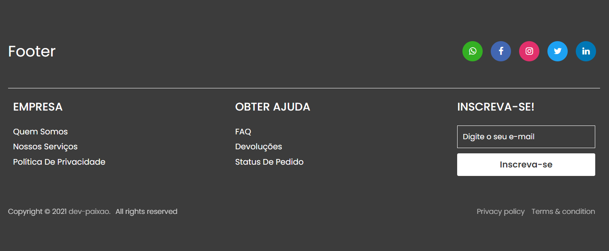

# Responsive Footer

Este é um projeto de design de um footer/rodapé simples feito com HTML e CSS.

## :rocket: Acesse a Demonstração

Para visualizar a demonstração do Responsive Footer, acesse o seguinte link: [Demo](https://dev-paixao.github.io/responsive-footer/)

## :rocket: Prévia do Projeto

## :clipboard: Sobre o Projeto

O Responsive Footer é um projeto que apresenta um design simples e responsivo para um rodapé de página. Ele foi desenvolvido utilizando HTML e CSS, e pode ser facilmente incorporado em diversos tipos de websites. O objetivo deste projeto é fornecer um exemplo básico de como criar um rodapé responsivo e estilizado para seus projetos web.

## :gear: Personalização

O design do Responsive Footer pode ser personalizado de acordo com suas preferências, ajustando o código CSS fornecido. Sinta-se à vontade para alterar as cores, o layout e os elementos visuais para atender às necessidades do seu projeto.

## :handshake: Contribuindo

Contribuições são bem-vindas! Se você deseja contribuir para este projeto, siga as etapas abaixo:

1. Faça um fork deste repositório.

2. Crie uma nova branch com uma descrição clara da sua alteração: `git checkout -b nome-da-sua-branch`.

3. Faça as alterações desejadas no código.

4. Realize commits com mensagens descritivas: `git commit -m "Descrição das alterações"`.

5. Envie as alterações para o seu repositório fork: `git push origin nome-da-sua-branch`.

6. Abra um pull request neste repositório, explicando as alterações que foram feitas.

7. Aguarde a revisão e o feedback.

## :page_facing_up: Licença

Este projeto está licenciado sob a licença [MIT](LICENSE).

